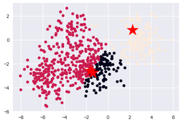

# dru-ML_labs
DataRoot University tasks on ML algorithms

## Task:

Fill in Jupyther Notebook templates with algorithms so that the result would pass the checks by the system. 

Themes for labs:
- Linear regression with one variable (Week 2)
- Linear regression with multiple variables (Week 2)
- Logistic regression (Week 2)
- KNN (Week 2)
- NBC (Week 2)
- Polynomial Ridge Regression (Week 2)
- Neural Network (Week 3)
- Support Vector Machine (Week 3)
- KMeans (Week 4)
- PCA (Week 4)

Year - 2018.
